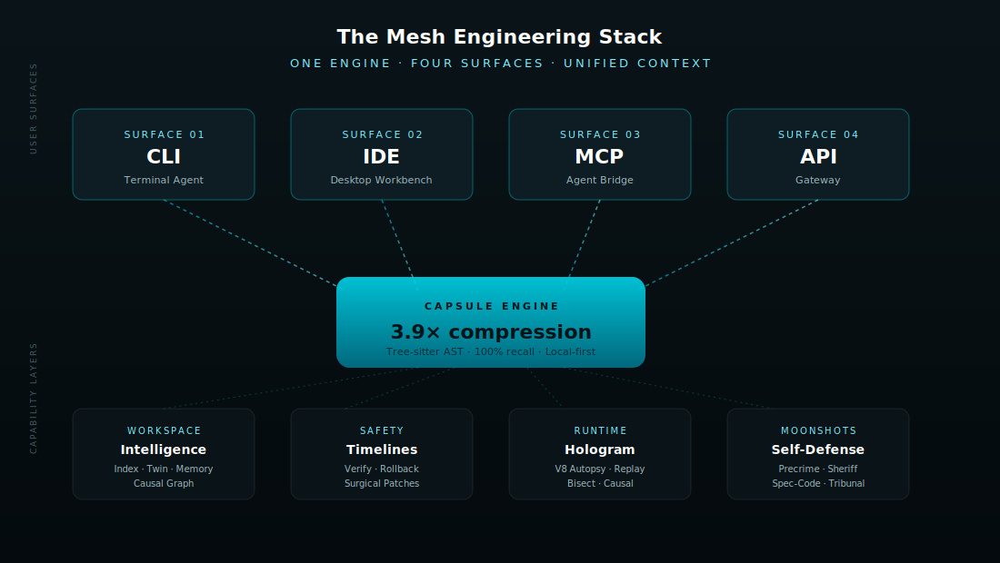
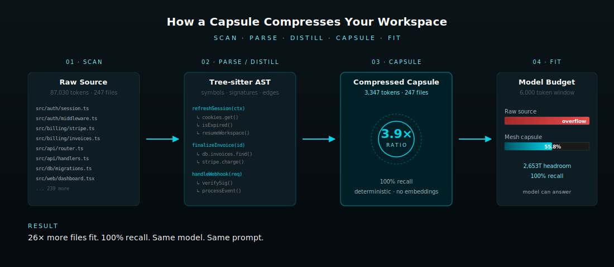
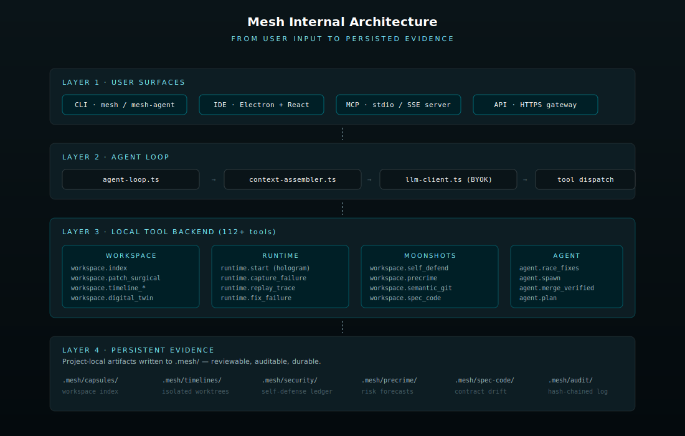
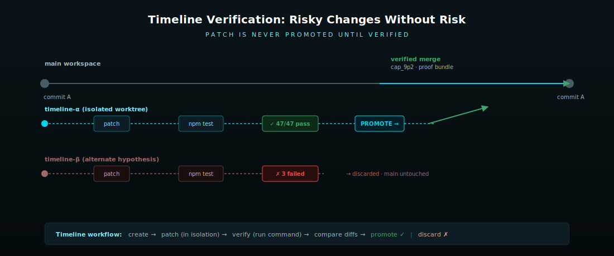
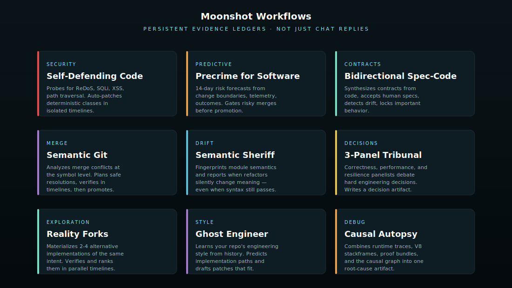

# The Mesh Engineering Stack

**A complete documentation of the Mesh AI engineering platform — CLI, IDE, MCP, and Gateway API, all powered by one capsule compression engine.**

> Version: 0.9.x (preview) · Last updated: April 2026

---

## Table of Contents

1. [What is Mesh?](#1-what-is-mesh)
2. [The Stack at a Glance](#2-the-stack-at-a-glance)
3. [The Capsule Engine — Core Intelligence](#3-the-capsule-engine--core-intelligence)
4. [Surface 1 — Mesh CLI (Terminal Agent)](#4-surface-1--mesh-cli-terminal-agent)
5. [Surface 2 — Mesh IDE (Desktop Workbench)](#5-surface-2--mesh-ide-desktop-workbench)
6. [Surface 3 — Mesh MCP (Agent Bridge)](#6-surface-3--mesh-mcp-agent-bridge)
7. [Surface 4 — Gateway API](#7-surface-4--gateway-api)
8. [Internal Architecture](#8-internal-architecture)
9. [Core Capabilities](#9-core-capabilities)
10. [Moonshot Workflows](#10-moonshot-workflows)
11. [Maturity & Roadmap](#11-maturity--roadmap)
12. [Comparison Matrix](#12-comparison-matrix)
13. [Recommended Daily Workflows](#13-recommended-daily-workflows)

---

## 1. What is Mesh?

Mesh is an **AI-native engineering platform** that turns your repository into an inspectable, testable, self-improving workspace. It's not just an autocomplete plugin or a chat-over-files product — it's a structured engineering context layer that LLMs can reason against without flooding their context window.

**The core idea:** code changes should be explored, verified, explained, and remembered. Mesh combines local code intelligence, runtime debugging, speculative worktrees, autonomous repair loops, semantic contracts, and project-level memory into a single coherent system delivered through four interchangeable surfaces.

Three things make Mesh different from generic coding assistants:

- **Compression with 100% recall.** Mesh's capsule engine compresses workspaces 3.9× on average using deterministic Tree-sitter AST analysis — no embeddings, no retrieval lottery, no hallucinated file paths.
- **Persistent evidence over chat.** Every meaningful operation writes a durable artifact to `.mesh/` — capsules, timelines, security ledgers, contract drift reports, audit chains. Knowledge survives the session.
- **Verification before promotion.** Risky changes run inside isolated timelines (worktree-backed) and have to pass user-defined verification commands before they ever touch your main workspace.

---

## 2. The Stack at a Glance



Mesh ships as **one engine** with **four surfaces**:

| Surface | Package | Best for |
|---|---|---|
| **CLI** | `@edgarelmo/mesh-agent-cli` | Terminal-native engineering, scripting, CI |
| **IDE** | `mesh-ide` (Electron app) | Visual workflows, refactors, design surfaces |
| **MCP** | `@edgarelmo/mesh-mcp` | Plugging Mesh into Claude Code, Cursor, Windsurf, VS Code |
| **API** | Gateway HTTPS endpoint | Embedding the agent loop into your own product |

All four surfaces share the same `.mesh/` workspace state. Index once via the CLI, query everywhere — the IDE, MCP server, and API all read the same capsule.

---

## 3. The Capsule Engine — Core Intelligence

The capsule engine is the heart of the stack. It transforms every file in your workspace into a compressed structural index — symbol maps, signatures, call edges, dependency hints — that fits comfortably inside any model's context window.



### How it works

1. **Scan.** Tree-sitter walks your tree, respecting `.gitignore` and `.mesh/exclude` rules.
2. **Parse.** Each file is parsed into an AST. Symbols, signatures, imports, and call edges are extracted.
3. **Distill.** The AST is reduced to a **capsule** — a structural summary that preserves enough information for the model to plan, but discards the noise (whitespace, repeated boilerplate, license headers).
4. **Cache.** Capsules are stored locally in two layers — an in-process L1 and a disk-backed L2 in `~/.config/mesh/`.
5. **Fit.** When the agent needs context, the `ContextAssembler` pulls relevant capsules and trims them to the model's budget. If the model needs the *exact* source, Mesh recovers byte-ranges directly from disk — never from a paraphrase.

### Why it matters

A typical codebase of 87,030 tokens compresses to **3,347 tokens** in capsule form (3.9× ratio in our reference workspace, 100% NIAH recall). That means **all 247 files** of a real project fit into a 6,000-token window with room to spare — instead of overflowing at file 23.

The compression is **deterministic** — there's no retrieval lottery, no embedding drift, no "we tried our best to find the right file." If a symbol exists in your repo, Mesh will find it.

---

## 4. Surface 1 — Mesh CLI (Terminal Agent)

The CLI is the canonical surface. Everything else wraps the same engine.

### Install

```bash
npm install -g @edgarelmo/mesh-agent-cli
mesh
```

Available commands after install: `mesh`, `mesh-agent` (alias), `mesh-daemon` (background daemon).

### What it does

- Maps your codebase: capsules, symbol maps, dependency hints, project memory.
- Edits real files via surgical patches with line-anchored validation.
- Runs commands under runtime observation, captures failures, and explains them.
- Creates **isolated timelines** for risky changes and only promotes them after user-defined verification passes.
- Persists project knowledge (Engineering Memory, Digital Twin, Causal Graph, Project Brain) so context survives between sessions.

### Slash command surface

Mesh exposes a rich slash command interface. Some highlights:

| Command | Purpose |
|---|---|
| `/index` | Re-index the workspace |
| `/status` | Runtime, model, session, git, and index state |
| `/intent <goal>` | Compile product intent into an implementation contract |
| `/twin build` | Build the Codebase Digital Twin |
| `/causal build` | Build the causal intelligence graph |
| `/fork <intent>` | Materialize alternate implementation realities |
| `/ghost` | Learn and replay your engineering style |
| `/lab` | Run autonomous discovery over project signals |
| `/repair` | Surface predictive repair opportunities |
| `/tribunal <problem>` | Convene a 3-panel AI tribunal for hard decisions |
| `/resurrect` | Save/restore session state across runs |
| `/sheriff scan` | Detect semantic drift in modules |
| `/hologram start <cmd>` | Run a command under runtime observation |
| `/replay <traceId>` | Replay a production trace locally |
| `/bisect <symptom>` | Auto-bisect a regression |
| `/preview <url>` | Capture a frontend screenshot in the terminal |
| `/inspect [url]` | Attach the visual agent portal |
| `/dashboard` | Launch the local supervision dashboard |
| `/voice` | Configure local Whisper-based speech mode |

A full command reference lives at [`mesh-cli-command-guide.md`](./mesh-cli-command-guide.md).

### Configuration

Important environment variables:

- `WORKSPACE_ROOT` — override the workspace root
- `BEDROCK_ENDPOINT` — custom LLM endpoint (BYOK)
- `BEDROCK_MODEL_ID` — override the default model
- `BEDROCK_FALLBACK_MODEL_IDS` — comma-separated fallback chain
- `BEDROCK_MAX_TOKENS` — output token cap
- `MESH_INDEX_PARALLELISM` — indexing concurrency (default 12)
- `MESH_EMBEDDING_MODEL` — local retrieval embedding model
- `MESH_STATE_DIR` — override local Mesh state directory

User settings live under `~/.config/mesh/`. Project artifacts live under `.mesh/`.

### Requirements

- Node.js 20 or newer
- macOS, Linux, or any environment with working npm globals
- *Optional:* Homebrew + `ffmpeg` + `whisper-cpp` for voice mode (macOS)
- *Optional:* Local Chrome / CDP for frontend preview and dashboard

---

## 5. Surface 2 — Mesh IDE (Desktop Workbench)

Mesh IDE is **a custom-built desktop environment**, not a browser tab and not a VS Code plugin. It's an Electron application designed from the ground up for agentic software engineering — the AI agent isn't bolted on, the entire UI is built around its loop.

### Architecture

A modern monorepo:

```
mesh-ide/
├── apps/
│   ├── web/        ← Electron + React + Vite (the workbench UI)
│   └── api/        ← local orchestration server (UI ↔ runtime bridge)
├── packages/
│   └── shared/     ← TypeScript types and schemas
└── brand/          ← visual assets and design tokens
```

### Core features

- **Agentic Runtime.** Built-in support for the Mesh agent loop. Specialized panels for plan preview, diff review, and tool execution — far beyond a chat sidebar.
- **Deep Terminal Integration.** A high-performance `node-pty` terminal that preserves state across views.
- **Multi-Model Support.** Switch between Gemini 2.0, Claude 3.7, and GPT-4o directly from the assistant panel.
- **AI-Native UI.** Custom diff viewers, plan previews, and tool-execution panels. Not "chat next to an editor" — the editor and agent share a context model.
- **Privacy First.** Local-first architecture. Code never leaves your machine; orchestration runs through a local API.

### Tech stack

- **Frontend:** React 19, TypeScript 6, Zustand
- **Editor:** Monaco (the engine behind VS Code)
- **Desktop:** Electron 41, Vite, `node-pty`
- **Styling:** custom CSS design system

### Getting started

```bash
git clone https://github.com/mesh-ide/mesh-ide.git
cd mesh-ide
npm install
npm run build
npm run dev          # development mode with HMR
```

Building the standalone app:

```bash
cd apps/web
npm run electron:build
# artifacts: apps/web/dist-electron-build
```

### Requirements

- Node.js 20+
- npm 10+
- macOS Apple Silicon recommended (Intel supported)

---

## 6. Surface 3 — Mesh MCP (Agent Bridge)

Mesh MCP is a specialized distribution that exposes the entire Mesh toolset to **any MCP-compatible client** — Claude Code, Cursor, Windsurf, VS Code. Instead of giving these agents raw files, Mesh hands them a structured engineering context layer with **112+ specialized tools**.

### Install

```bash
# Global install (recommended for daily usage)
npm install -g @edgarelmo/mesh-mcp

# Start server mode for HTTP MCP clients
mesh mcp serve --port 7400

# Ephemeral run (no global install)
npx -y @edgarelmo/mesh-mcp

# Optional diagnostics
npx @edgarelmo/mesh-mcp doctor
```

### What your agent gains

By running Mesh as an MCP server, your AI assistant gets immediate access to:

- **Workspace Intelligence**
  - *Semantic Mapping* — hybrid ranked file search, symbol dependency chains, digital twin building
  - *AST Compression* — high-performance code compression that fits large codebases into small token windows
  - *Causal Intelligence* — understand not just what the code is, but why it's structured that way

- **Safe Code Engineering**
  - *Surgical Patching* — pinpoint accurate edits via `workspace.patch_surgical` without token waste
  - *Isolated Timelines* — test changes in speculative realities before promoting them
  - *Reality Forks* — explore multiple alternative implementation paths for a single intent

- **Runtime & Debugging**
  - *Hologram Tracing* — start commands under observation to capture stack traces and causal autopsies
  - *Predictive Repair* — surface and fix failing diagnostics before they become bugs
  - *Self-Defending Code* — proactively probe and harden security-sensitive patterns

### MCP Prompts (Slash Commands)

The MCP distribution exports high-level workflows as MCP prompts. In clients like Claude Code, these appear as guided actions:

| Prompt | CLI Equivalent | Description |
|---|---|---|
| `mesh_debug_issue` | `/fix` | Systematic debugging with progressive context |
| `mesh_implement_change` | `/implement` | Targeted reads + impact analysis |
| `mesh_review_diff` | `/review` | Deep review of uncommitted changes & risk |
| `mesh_ask_codebase` | `/ask` | Semantic query over the entire codebase |
| `mesh_synthesize` | `/synthesize` | Full-stack updates from raw intent |
| `mesh_setup` | `/setup` | Initialize and index the current workspace |

### Client configuration

**Claude Desktop / Claude Code** — use either `mesh mcp serve --port 7400` (HTTP mode) or `npx -y @edgarelmo/mesh-mcp` (stdio mode). Manual stdio config:

```json
{
  "mcpServers": {
    "mesh": {
      "command": "npx",
      "args": ["-y", "@edgarelmo/mesh-mcp"],
      "env": {
        "MESH_WORKSPACE_PATH": "/absolute/path/to/your/project"
      }
    }
  }
}
```

**Cursor / Windsurf** — add a new MCP server in settings:

- Type: `stdio`
- Command: `npx -y @edgarelmo/mesh-mcp`
- Env: `MESH_WORKSPACE_PATH=/your/project/path`

> Mesh MCP automatically bridges to a locally installed `@edgarelmo/mesh-agent-cli` if found, picking up the latest features from your CLI install.

---

## 7. Surface 4 — Gateway API

The Gateway API is a thin HTTPS layer over the same engine. Bearer-token auth, rate-limited per key. Designed for embedding the full Mesh agent loop into your own product.

### Authentication

```bash
curl https://api.mesh.dev/v1/me \
  -H "Authorization: Bearer $MESH_KEY"
```

### Index a repository

```bash
curl -X POST https://api.mesh.dev/v1/capsules \
  -H "Authorization: Bearer $MESH_KEY" \
  -d '{"repo":"github.com/acme/payments","branch":"main"}'
```

Returns a `capsule_id` you can query against, with stats: `files`, `tokens_in`, `tokens_out`, `ratio`, `recall`, `status`.

### Search and recover

```bash
# Structural search
curl "https://api.mesh.dev/v1/search?q=stripe.charge&capsule=cap_8kX9z2a" \
  -H "Authorization: Bearer $MESH_KEY"

# Recover the exact span (verbatim, byte-for-byte)
curl "https://api.mesh.dev/v1/recover?capsule=cap_8kX9z2a&path=src/billing/invoices.ts&line=18&context=10" \
  -H "Authorization: Bearer $MESH_KEY"
```

### Error model

| Code | Meaning | Action |
|---|---|---|
| `401` | Missing/invalid bearer token | Check `$MESH_KEY` |
| `404` | Capsule not found | Re-index — capsules expire after 30 days |
| `422` | Invalid query | Inspect `error.detail` |
| `429` | Rate-limited | Backoff. Read `Retry-After` |
| `503` | Indexing in progress | Poll `GET /v1/capsules/:id` until `ready` |

---

## 8. Internal Architecture



The agent loop has four well-separated layers:

### Layer 1 — User Surfaces

CLI, IDE, MCP, and API. They share the same agent loop entrypoint and the same `.mesh/` state on disk. The CLI is canonical; the others wrap it.

### Layer 2 — Agent Loop

- **`agent-loop.ts`** — receives user input or slash commands and orchestrates the run.
- **`context-assembler.ts`** — trims the transcript, tools, and runtime context to the model's budget.
- **`llm-client.ts`** — calls the model via the Mesh LLM proxy or a BYOK endpoint.
- **`tool-dispatch`** — routes to the local tool backend.

### Layer 3 — Local Tool Backend (112+ tools)

Four tool families, each with persistent ledgers:

- **Workspace tools** — `index`, `patch_surgical`, `timeline_*`, `digital_twin`, `causal_intelligence`, `engineering_memory`, `discovery_lab`, `reality_fork`, `ghost_engineer`, `intent_compile`, `predictive_repair`, `audit`, `daemon`, `issue_pipeline`, `chatops`, `production_status`, `what_if`, `symptom_bisect`, `brain`.
- **Runtime tools** — `start` (hologram), `capture_failure`, `explain_failure`, `fix_failure`, `replay_trace`.
- **Moonshot tools** — `self_defend`, `precrime`, `semantic_git`, `spec_code`, `natural_language_source`, `fluid_mesh`, `living_software`, `proof_carrying_change`, `causal_autopsy`, `tribunal`, `session_resurrection`, `semantic_sheriff`.
- **Agent tools** — `race_fixes`, `spawn`, `review`, `merge_verified`, `plan`.

### Layer 4 — Persistent Evidence

Many features write to `.mesh/` instead of returning chat replies. This is intentional — *evidence first, automation later*:

| Path | Contents |
|---|---|
| `.mesh/capsules/` | workspace index |
| `.mesh/timelines/` | isolated worktrees |
| `.mesh/security/` | self-defense ledger |
| `.mesh/precrime/` | risk forecasts |
| `.mesh/spec-code/` | bidirectional contracts and drift |
| `.mesh/semantic-git/` | merge plans and resolutions |
| `.mesh/semantic-contracts/` | sheriff fingerprints |
| `.mesh/tribunal/latest.json` | tribunal decisions |
| `.mesh/audit/` | hash-chained tool-call log |
| `.mesh/dashboard/` | live event stream for the supervision UI |

### Safety layers

- **Tool-input validation.** Every tool call is validated against a JSON schema (`src/tool-schema.ts`).
- **Command safety.** Destructive shell patterns are blocked by pattern guards (`src/command-safety.ts`).
- **Runtime allowlisting.** `NODE_OPTIONS` injection is allowlisted (`src/runtime-observer.ts#mergeNodeOptions`).
- **Audit hash-chain.** Every tool call is hash-linked to the previous one; `/audit` verifies integrity.
- **Sensitive-path policy.** Critical paths can be marked read-only or require explicit approval.

---

## 9. Core Capabilities

### Workspace Intelligence

Mesh maintains a persistent understanding of your repository. Capsules, symbol maps, dependency hints, codebase summaries, and project memory mean large repos don't have to be re-read every turn.

- `/index` re-indexes
- `/status` shows runtime + index state
- `/capsule` manages compressed session memory
- `/distill` updates the project brain
- `/twin` builds or reads the Codebase Digital Twin

### Safe Code Changes



Risky changes can run in isolated timelines (worktree-backed, with a copy fallback) and pass user-defined verification before promotion. Patch generation and promotion are intentionally separated.

- Isolated timeline creation and verification
- Patch validation and surgical edits
- Command-safety checks for destructive shell patterns
- Tool-input validation before execution
- Undo for recent agent file changes

### Runtime Debugging

Mesh starts commands under runtime observation, captures failures, extracts stack traces, and explains likely causes. For Node.js, an inspector-backed autopsy path can capture deeper exception context when available.

Useful commands:

- `/hologram start <cmd>`
- `/replay <traceId|sentryEventId>`
- `/bisect <symptom>`
- runtime tools: `runtime.capture_failure`, `runtime.explain_failure`, `runtime.fix_failure`

### Autonomous Engineering Workflows

- `/intent <goal>` — compile product intent into an implementation contract
- `/fork <intent>` — alternate implementation realities
- `/ghost` — learn and replay the local engineer's style
- `/lab` — autonomous discovery over project signals
- `/repair` — predictive repair opportunities
- `/tribunal <problem>` — structured AI panel for hard engineering decisions
- `/resurrect` — capture or restore session state

### Developer Experience

- `/preview <url>` — frontend screenshot in the terminal
- `/inspect [url]` — visual agent portal for UI inspection
- `/dashboard` — local supervision dashboard for project state and tool events
- `/voice [on|off|setup]` — local speech-to-speech (Whisper + system TTS)

---

## 10. Moonshot Workflows

Beyond the daily-driver capabilities, Mesh ships several advanced workflows that turn the codebase into a more active system. They share a design philosophy: **persistent evidence over chat replies**, **timeline verification over blind edits**, **conservative automation with explicit promotion gates**.



### Self-Defending Code

`workspace.self_defend` scans and probes security-sensitive patterns, confirms selected vulnerability classes, writes security ledgers, and can create verified timeline patches for deterministic fixes (e.g. simple ReDoS hardening). For SQLi, path traversal, or command injection, Mesh confirms and reports — but doesn't fully auto-patch.

### Precrime for Software

`workspace.precrime` predicts likely future incidents from changed files, risk boundaries, telemetry signals, local outcome history, and optional global Mesh Brain patterns. Can gate risky changes before promotion. Currently rule- and outcome-based; not a globally-trained model.

### Bidirectional Spec-Code

`workspace.spec_code` synthesizes behavior contracts from code, routes, and tests; accepts human-declared specs; detects drift; locks important contracts; and emits materialization plans for missing behavior.

### Semantic Git

`workspace.semantic_git` analyzes merge conflicts at the symbol level, plans safe resolutions, verifies them in timelines, and only promotes when explicitly requested and verification passes. Handles distinct-symbol conflicts well; sensitive or overlapping conflicts still require review.

### Semantic Sheriff

`/sheriff` fingerprints module semantics and reports when refactors silently change what code means, even if syntax still looks valid. Complements (does not replace) a real test suite.

### Reality Forks

`workspace.reality_fork` materializes 2-4 alternative implementations of the same intent in parallel timelines, runs verification on each, and ranks them. Useful before committing to an architectural direction.

### Ghost Engineer

`workspace.ghost_engineer` learns your repo's engineering style from history, predicts implementation paths, and drafts patches that fit. Style-aware, not generic.

### 3-Panel Tribunal

`workspace.tribunal` convenes Correctness, Performance, and Resilience panelists who debate hard engineering decisions and write a decision artifact to `.mesh/tribunal/latest.json`. Decision-support, not formal proof.

### Causal Autopsy

`workspace.causal_autopsy` combines runtime traces, V8 stackframes, proof bundles, and the causal graph into a single root-cause artifact.

### Living Software & Proof-Carrying Changes

Additional experimental workflows include:

- `workspace.natural_language_source` — natural-language intent → implementation IR
- `workspace.fluid_mesh` — capability map across scripts, routes, and reusable functions
- `workspace.living_software` — pulse over moonshot ledgers and self-maintenance signals
- `workspace.proof_carrying_change` — promotion proof bundle with risks, contracts, verification, and rollback
- `workspace.session_resurrection` — capture/restore intent, open questions, and next actions

---

## 11. Maturity & Roadmap

Mesh is actively evolving. Different parts of the system sit at different maturity levels — by design.

### Solid / production-ready

- File read/search/patch/write
- Tool schema validation
- Command safety blocklist
- Capsule cache (L1 + L2 batch fetch)
- Timeline create/run/compare/promote (with copy fallback)
- Runtime observer with Node/V8 autopsy
- Audit hash chain
- Model catalog and fallback handling
- `spec_code`, `semantic_git`, `self_defend`, `precrime` as local, test-covered ledgers/workflows

### Production-usable, treat conservatively

- `/dashboard` — useful as a supervision UI; visual/3D rendering is a cockpit, not hard verification
- `/voice` — depends on local platform, ffmpeg, whisper-cpp, model downloads
- `/issues`, `/chatops`, `/production` — quality depends on correctly configured integrations
- `/brain` — global benefit depends on endpoint, opt-in, and real pattern corpus
- `/tribunal` — structured decision-support, not formal proof
- `/sheriff` — fingerprint-based drift detection, complements (doesn't replace) tests

### Experimental, not 100% production-perfect

- **Self-defending code** — auto-patching is deterministic only for simple ReDoS classes; SQLi/path traversal/command injection are confirmed and reported but not auto-patched.
- **Precrime** — local future-self model is rule/outcome-based; a globally-trained model over many codebases isn't yet in this codebase.
- **Semantic Git** — solves distinct-symbol conflicts well; full semantic branchless Git is still research.
- **Bidirectional Spec-Code** — contracts, drift, locks, materialization plans exist; full code generation from arbitrary specs is intentionally not automatic.
- **Natural language as source** — compile-to-IR exists; natural language as primary source-of-truth isn't there yet.
- **Fluid Mesh / Living Software** — capability map and pulse exist; cross-repo governance/IP/runtime migration is open.
- **Ephemeral Execution** — zero-source/JIT execution is an endgame experiment.
- **Schrödinger AST / Entangle** — strongly experimental; only with isolated verification.

> **Use timeline verification, tests, and review gates for production-critical changes.**

---

## 12. Comparison Matrix

| Capability | CLI | IDE | MCP | API |
|---|:-:|:-:|:-:|:-:|
| Capsule compression engine | ✅ | ✅ | ✅ | ✅ |
| Workspace indexing | ✅ | ✅ | ✅ | ✅ |
| Surgical patching | ✅ | ✅ | ✅ | ⚪ |
| Isolated timelines | ✅ | ✅ | ✅ | ⚪ |
| Reality forks | ✅ | ✅ | ✅ | ⚪ |
| Runtime hologram + autopsy | ✅ | ⚪ | ✅ | ⚪ |
| Voice mode (Whisper) | ✅ | ⚪ | ⚪ | ⚪ |
| Visual dashboard | ✅ | ✅ | ⚪ | ⚪ |
| Frontend preview | ✅ | ✅ | ⚪ | ⚪ |
| Self-defending code | ✅ | ✅ | ✅ | ⚪ |
| Precrime risk gates | ✅ | ✅ | ✅ | ⚪ |
| Semantic Git | ✅ | ✅ | ✅ | ⚪ |
| Semantic Sheriff | ✅ | ✅ | ✅ | ⚪ |
| 3-Panel Tribunal | ✅ | ✅ | ✅ | ⚪ |
| Multi-model BYOK | ✅ | ✅ | ✅ | ✅ |
| Embedded in Claude Code/Cursor | ⚪ | ⚪ | ✅ | ⚪ |
| Programmable HTTPS endpoint | ⚪ | ⚪ | ⚪ | ✅ |
| Suitable for CI/CD | ✅ | ⚪ | ⚪ | ✅ |

✅ first-class · ⚪ not the right surface for this

---

## 13. Recommended Daily Workflows

### Understand a new repository

```text
/index
/twin build
/causal build
explain the main request path and the riskiest modules
```

### Make a risky change safely

```text
/intent migrate auth middleware to the new session model
/fork plan migrate auth middleware to the new session model
run the safest timeline and verify with npm test
```

### Debug a runtime failure

```text
/hologram start npm test
explain the captured failure and propose the smallest timeline fix
```

### Harden a project

```text
run self defense probe on the repo
run precrime gate on changed files
/sheriff scan
/sheriff verify
```

### Resolve merge conflicts semantically

```text
run semantic git analyze on the conflicted file
plan a semantic resolution
resolve it in a timeline and verify before promotion
```

### Daily quality / safety pass

1. `workspace.spec_code action=synthesize`
2. `workspace.self_defend action=probe`
3. `workspace.precrime action=gate`
4. `/sheriff scan`, then `/sheriff verify`
5. `/causal build` or `/lab run`

---

## License

Mesh CLI, MCP, and the marketing site are all distributed as **UNLICENSED** packages — all rights reserved. Mesh is not released under MIT or any other open-source license.

Mesh IDE is currently a private Mesh Team project; see the IDE repository for current licensing terms.

---

*For the most up-to-date information, see the per-package READMEs:*

- *CLI: [`@edgarelmo/mesh-agent-cli` on npm](https://www.npmjs.com/package/@edgarelmo/mesh-agent-cli)*
- *MCP: [`@edgarelmo/mesh-mcp` on npm](https://www.npmjs.com/package/@edgarelmo/mesh-mcp)*
- *IDE: github.com/mesh-ide/mesh-ide*
- *Slash command guide: [`mesh-cli-command-guide.md`](./mesh-cli-command-guide.md)*
